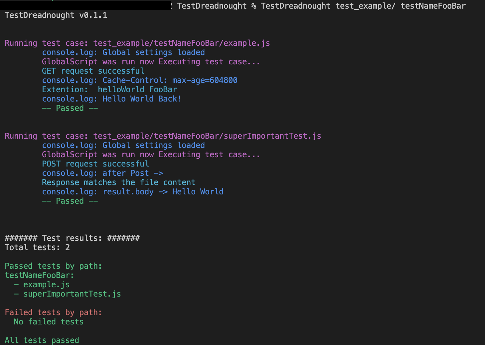

<p align="center">
  
</p>

# TestDreadnought

Highly adoptable test Framework for large and complex projects, that need a dependency-conscious, secure and fast testing solution.  

TestDreadnought is built for you to mold precisely to your project's demands, avoiding the one-size-fits-all approach. It sidesteps dependency issues and the security risks of excessive third-party packages, particularly from JS npm. With no forced structure or excessive rules, you get a clean, efficient, and secure testing environment that’s exactly suited to tackle your unique challenges.

<p align="center">
	  
</p>

## Install
Since you need to build the extensions aka plugins in Go, you need to have Go installed on your machine. Make sure you have the `$GOPATH/bin` in your `$PATH` environment variable - See [instructions](https://stackoverflow.com/a/21012349).  

```bash
go install github.com/i5heu/TestDreadnought
```

Now you can use `TestDreadnought` in your terminal.
```bash
$ TestDreadnought
TestDreadnought <test-root-directory> <optional: subset path relative to config-directory>
```

If you want to update TestDreadnought just run the install command again.

## ClI Usage
There are 2 CLI options, the test-root-directory and the optional "subset path" that is relative to the test-root-directory.  
If you provide no arguments, TestDreadnought will show this message:

```bash
$ TestDreadnought
TestDreadnought Usage: TestDreadnought <test-root-directory> <optional: subset path relative to config-directory>
```


## Setup
There must be a `globalScript.js` file in the root directory of your test folder.  
This script is called before any `.js` file in the test root directory and its subdirectories.  
It is best used to define global variables and functions that are used in multiple tests.  

We suggest you put into here a variable ´globalSettings´ that contains, for example, the base URL of your API.

```js
// testRootDirectory/globalScript.js
var globalSettings = { // This is a global variable that can be used in all tests
    baseUrl: "https://example.com", // This is the base URL of your API 
    headers: {
        "Origin": "https://this.is.a.example.com"
    }
};

var ThisIsTest = function () {
    console.log("This is a test"); // This will be callable in all Tests.
}

console.log("Global settings loaded"); // This will be printed in the console before executing an test
```

There must also be a `extensions.go` Plugin in the `extensions/out` folder.  
You can copy a example one from the `test_example` folder.
See the "Building your own extensions" section for more information.  

## Writing your first test

TestDreadnought uses ES5 JavaScript as language for writing tests.  
We choose JS as it is widely used and allows for more familiarity and easier onboarding.  
As you will see, JS is preferably only used as a kind of routing for data and simple logic that is test case relevant, all requests in the default HTTP requests functions are made in golang and callable via fake JS functions, aka extensions.  

Lets write your first test, that will Get a request to the base URL of your API.
```js
// testRootDirectory/test/helloWorld.js - note that there is no forced structure
// TestDreadnought it will test all .js files in all directories of the test folder,
// unless you specify to test only a subset

// This is the global variable from the globalScript.js file
Settings = globalSettings; 

// This will make a GET request to the base URL and the path /helloWorld using the headers defined in the Settings variable
result = Get("/helloWorld");

// This will print the result of the request to the console
console.log("Cache-Control:", result.header["Cache-Control"]);  

// if no error is thrown the test is successful
```

Note that the Settings variable is used by the Get function and all default client functions to get the base URL and headers.  
The structure for this looks like this:
```js
Settings = {
	baseUrl: "https://example.com",
	headers: {
		"Origin": "https://this.is.a.example.com"
	}
}
```

For more examples checkout the `test_example` folder in this repository.

## Building your own extensions  

Extensions are a way to add custom functionality to TestDreadnought.  
They are meant for more complex steps and time sensitive measurements, like performance testing.  
We use Go Plugins for extensions since for a lot of tests JS is not precise enough or capable enough in a elegant way and without a lot of third party packages, which are a security risk.  

To build an extension you need to create a `.go` file in the `extensions` folder, and build it to `extensions/out/extension.so`.
The Plugin you are building must have a function that is called in the `SetUpExtensions` function.

```go
// extensions/example.go
package main

import (
	fmtLog "github.com/i5heu/TestDreadnought/pkg"
	"github.com/robertkrimen/otto"
)

func SetUpExtensions(vm *otto.Otto, testCaseParentFolder, configDir string) {
	exampleHelloWorld(vm, testCaseParentFolder, configDir)
}

func exampleHelloWorld(vm *otto.Otto, testCaseParentFolder, configDir string) {
	vm.Set("ExampleHelloWorld", func(call otto.FunctionCall) otto.Value {
		incomingValue := call.Argument(0).String()

		// This is a custom log function that will format the log message and give it the right color
		fmtLog.Log("helloWorld", incomingValue) 

		back := "Hello World Back!"
		value, err := vm.ToValue(back)
		if err != nil {
			panic(err)
		}

		return value
	})
}
```

Before you can use the extension in your tests you need to build it.
```bash
go build -buildmode=plugin -o extensions/out/extension.so extensions/example.go
```

Now you can call the `ExampleHelloWorld` function in all your tests.
```js
// testRootDirectory/test/helloWorld.js
console.log(ExampleHelloWorld("FooBar"))
```

## List of default functions

TestDreadnought comes with a few default functions that are used to make HTTP requests and compare the result with a file.

### Get, Post, Patch, Delete
Will use the Settings variable to get the base URL and headers.  

```js
result = Get("/path")
result = Post("/path", {key: "value"})
result = Patch("/path", {key: "value"})
result = Delete("/path")
```

### ResultIsLikeFile

Will compare Data with a file in the same directory as the test file.  
You can see it working in the `test_example` folder.

```js
ResultIsLikeFile(result.body, "./GlobalResultExample.txt");
```

### ResultIsLikeGlobalFile

Will compare Data with a file in the globalTestFiles directory of the test folder.  
You can see it working in the `test_example` folder.

```js
ResultIsLikeGlobalFile(result.body, "./GlobalResultExample.txt");
```

### console.log
Since we need to format the output and add color, `console.log` is a custom function that will do this for you.
Pls note that `console.error`, `console.warn`, `console.info` and `console.debug` are not implemented yet and will result in a error.

```js
console.log("This is a log message")
```

### Log
Same as `console.log` but with a shorter name ✨. 

```js
Log("This is a log message")
```